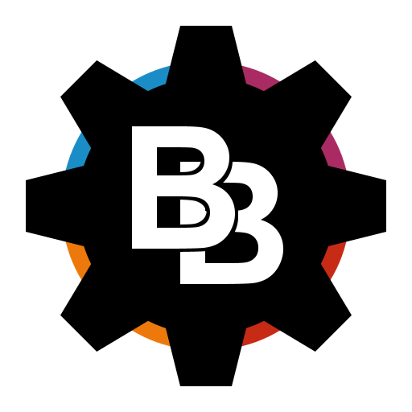

# BeatScript



A relatively simple Godot 4 Plugin to load external GDScripts to use for modding. I made this to use in my source mod of Beat Banger. It mostly contains helper functions and will require knowledge in GDScript to use. For modders, I recommend using [Godot RE Tools](https://github.com/GDRETools/gdsdecomp) to decompile the source so you can use it alongside your softcoded scripts unless a wiki exists.

## Implimentation Example

This is an example for programmers on how to impliment the script loader. This should either be used on a different singleton so it doesn't get called again, or in a scene if you want to remove and re-add the scripts per scene.

```gdscript
signal a_signal()

func _ready():
	for script in BeatScript.get_scripts_at("res://scripts"):
		# Set the second argument to `true` if you're addings scripts to run across the game
		BeatScript.add_script("res://scripts".path_join(script), true)

	for node in BeatScript.scripts.get_children():
		BeatScript.connect_node(node, "_on_a_signal", a_signal)
		BeatScript.connect_node(node, "_on_b_signal", SingleTon.b_signal)


func _exit_tree():
	# Not sure if this is needed, but I prefer it to not clog the signal list
	for node in BeatScript.scripts.get_children():
		BeatScript.disconnect_node(node, "_on_a_signal", a_signal)

	# Definitally needed for the root scene script, removes all non-global scripts
	BeatScript.clear_scripts()
```
